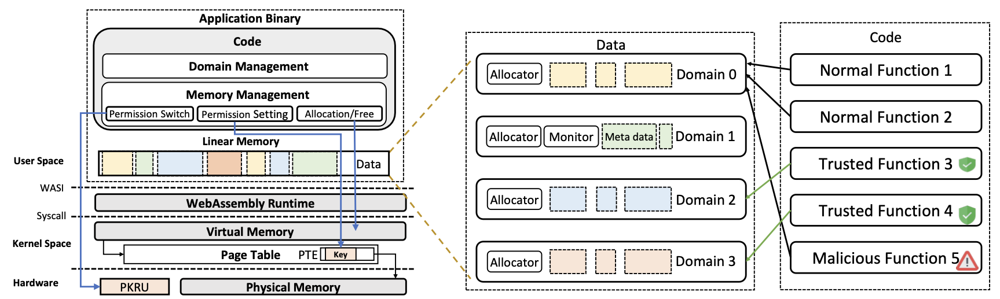
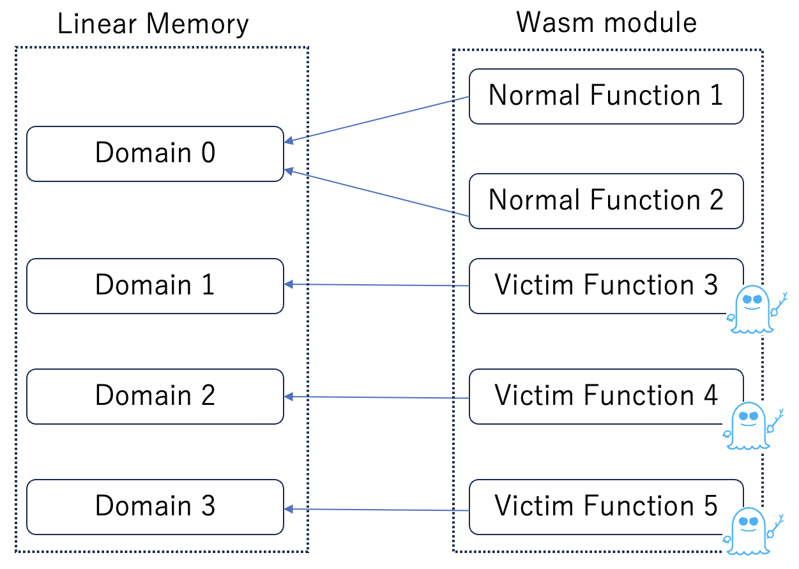

## 進捗報告(7/1)

### 今週やったこと

- 論文紹介の準備
  - Fuzzm: Finding Memory Bugs through Binary-Only Instrumentation and Fuzzing of WebAssembly (arXiv'21)
- PKUWA[CCS'23]の理解
  - Spectreに対処できていないのか？
  - 著者にメールで質問
- 研究アイデアの深掘り

### PKUWAの概要

- 開発者が関数にドメイン(リニアメモリのセグメント)を割り当てることで、その関数はドメイン内の領域しかアクセスできなくなる.

**PKUWAの使い方**

- 開発者はC/C++およびRust用のAPIセットを利用して、アプリを開発する.
- 関数内のオブジェクトは割り当てたドメイン内に配置される.

1. すべての関数をドメイン0(デフォルトのドメイン)に接続 (pku_init()).
2. 新しいドメインを作成し、ドメインIDを取得 (domain_create()).
3. 関数をドメイン0から新しいドメインに切り替える (PKU_CALL_REGISTER()).

### PKUWAを用いたSpectre防御

#### 問題提起

- 既存のランタイム(wasmtimeなど)では、全てのリニアメモリアクセスに対し、Spectre防御を適用する.
- かつそれらは投機実行を抑制するため、実行時のオーバーヘッドが大きい

#### 提案手法

- PKUWAを利用してSpectre脆弱性を含む関数のメモリアクセス範囲を限定する
- 投機実行は抑制しないが、メモリアクセス時に権限のチェックが必要になる
  - どちらが早いのかは疑問

#### 構成要素

- ガジェット探索
  - Wasmモジュール内のSpectre脆弱性を含む関数を特定
- PKUWAの適用
  - 特定した関数にドメインを割り当て、アクセス可能なメモリ範囲を制限する.
  - それ以外の関数はデフォルトのドメインを使用.

#### 考えなきゃならない所

- ドメイン数の制限

  - Spectre脆弱性を含む関数はそれぞれ個別のドメインを割り当てる必要がある.
  - intel MPKは最大16個のProtection Keyしか持てないため、最大で16個のドメインにしか使用できない.
  - libmpkを使えばこの制限は問題ないと思われる.
  - ドメインを絞ることは工夫できる点かもしれない
    - 互いに影響を与えないvictim関数のドメインはマージするとか

- Spectre攻撃の防御

  - サンドボックス内のメモリ分離では、サンドボックス境界をバイパスするSpectre攻撃には対処できない.
  - 複数のwasmモジュールを単一プロセスで動かすFaaSプラットフォームなどで問題になる.
  - これに対処するには、ランタイム上で動作している全てのWasmモジュール全体で、メモリ分離を行う必要がある.

- 解析対象

  - PKUWAはC/C++またはRust用のAPIの形で提供されるため、wasmバイナリに直接適用できない.
  - 専用のコンパイラによってPKUWAが実行できるWasmバイナリを生成する.
  - ガジェット探索も高級言語を対象にする必要がある?

- **自分のやることが少ない気がする**
  - 何か工夫できることを探す.

### 関連研究

- Going beyond the Limits of SFI: Flexible and Secure Hardware-Assisted In-Process Isolation with HFI (ASPLOS' 23)
  - HFIは、Wasmとネイティブバイナリのプロセス内分離をサポートするISA拡張機能.
  - WasmのSFIに変わってハードウェア支援によるプロセス内分離を行い、Wasmのサンドボックスを効率的に堅牢化
  - サンドボックス外のデータを読み取ろうとするSpectre攻撃を防御
  - 論文内でMPKベースのサンドボックスとも比較

### 今後の予定

- 研究のアイデアの深掘り
