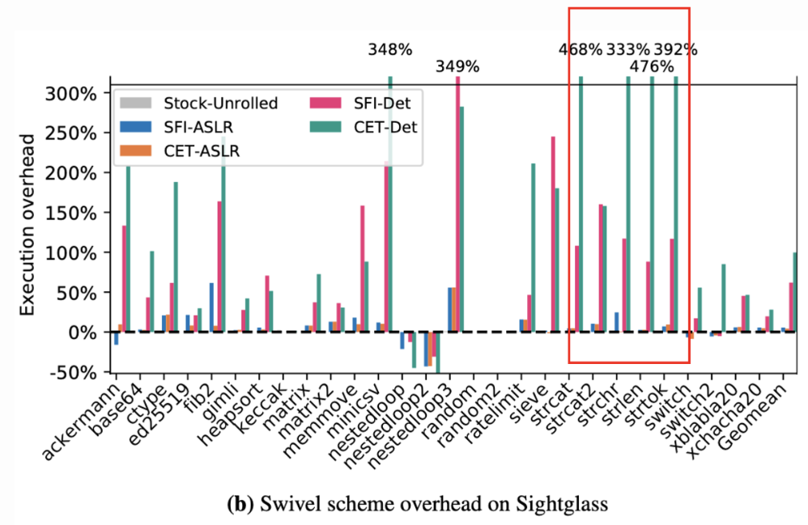
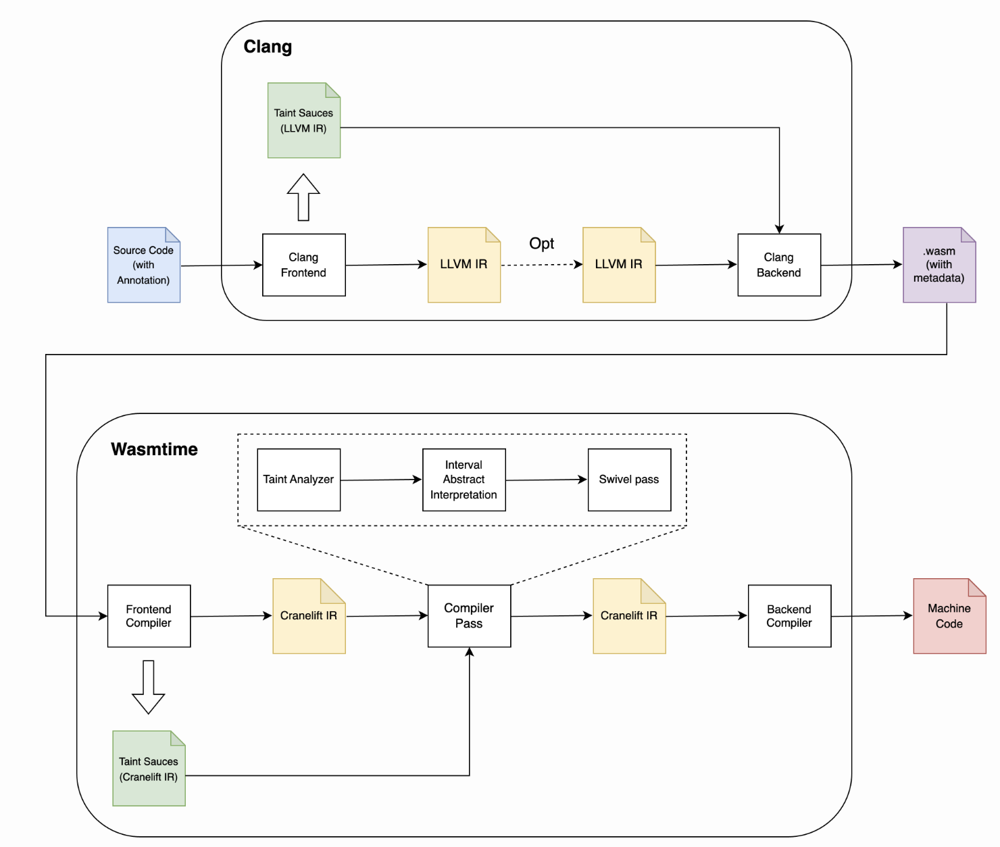

## 進捗報告(8/14)

### 先週やったこと

- Motivating Exampleのプロトタイプ作成
- アノテーションの付け方の調査
- 実装方法の調査

### Motivating Example

- ループ内の命令の投機実行を抑制すると大きなオーバヘッドが発生する.
- Swivelはオーバヘッド削減のために、条件分岐数を減らすため、ループアンローリングを行う.
- コンパイル時に展開できないデータ依存ループが多数存在する場合、大きなオーバヘッドが発生
- Sightglass の文字列操作ベンチマークがその例
  - https://github.com/bytecodealliance/sightglass/tree/4999f901b3d686a911dfe24b588d6397ca2b193a/benchmarks/shootout
  - 最新のバージョンからは削除されている
- data-dependent loopsとは？- ループ内の命令の結果が条件に影響するループのこと？
  > Some of the largest overheads in Figure 5 are on Sightglass’ string manipulation benchmarks, e.g., strcat and strlen. These microbenchmarks have lots of data-dependent loops—tight loops with data-dependent conditions—that cannot be unrolled at compile-time.



**Motivating Example**

- xがユーザによって操作不可能な場合は値が限定される(定数 or ランダムな値)
- 操作できても(直接、間接的に問わず)、値の幅は限定されるかも
- コールグラフ構築が難しくなる要因も入れたい

```c=
#define ARRAY1_SIZE 16

typedef struct {
    uint8_t array1[ARRAY1_SIZE];
    uint8_t not_secret_data[100];
    uint8_t secret_data[100];
} MyData;

MyData data;
uint8_t array2[256 * 512];
uint8_t temp = 0;

void victim_function(int x) {  // 0 <= x <= 100
  while (x < ARRAY1_SIZE) {
    register_interlock();
    temp &= array2[data.array1[x] * 512];
    x = x + 1;
  }
}

void foo(int a) {
    int b = 10;
    if (0 <= a　 && a <= 100) b = a;
    victim_function(b);
}
```


### アノテーションの付け方の調査

#### attributeを使う方法(Clang)

C++

```=c
#define SECRET __attribute__((annotate("secret info")))

int foo(int param) {
  SECRET int　var = param;
  // int SECRET var = param;
  // int　var SECRET = param;
  return var;
}
```

以下でも同様

```=c
#define SECRET [[clang::annotate("secret")]]

int foo(int param) {
  SECRET int　var = param;
  // int SECRET var = param;だとコンパイルエラー
  return var;
}
```

LLVM IR

```=llvm
@.str = private unnamed_addr constant [12 x i8] c"secret info\00", section "llvm.metadata"
@.str.1 = private unnamed_addr constant [9 x i8] c"main.cpp\00", section "llvm.metadata"

define i32 @_Z3fooi(i32 noundef %0) #0 {
  %2 = alloca i32, align 4
  %3 = alloca i32, align 4
  store i32 %0, ptr %2, align 4
  call void @llvm.var.annotation(ptr %3, ptr @.str, ptr @.str.1, i32 4, ptr null)
  %4 = load i32, ptr %2, align 4
  store i32 %4, ptr %3, align 4
  %5 = load i32, ptr %3, align 4
  ret i32 %5
}
```

- llvm.var.annotation は LLVM で提供される組み込み関数で、ローカル変数に任意の文字列を注釈として付与する.
- メタデータはLLVMのグローバルテーブル@llvm.global.annotationsに配置
- attributeで付与したメタデータはwasmには落ちているか？
  - https://llvm.org/docs/LangRef.html#id1722
  - wasm-objdumpで16進数でダンプ
  - 生成された.wasmを確認したが、それらしいものは見当たらない
- 何に対して属性を付与できる？
  - Clangのリファレンスには詳しく書かれていない
    - https://clang.llvm.org/docs/AttributeReference.html#annotate
  - GCCのリファレンスには書かれていない
    - https://gcc.gnu.org/onlinedocs/gcc-3.1.1/gcc/Variable-Attributes.html
- https://blog.quarkslab.com/implementing-a-custom-directive-handler-in-clang.html
- https://qiita.com/Chironian/items/8770c8ab833086fb51a9

#### attributeを使う方法(Rust)

Rust

```=rust
#[link_section = "secret-info"]
static SECRET_MESSAGE: [u8; 24] = *b"This is a secret message";

fn main() {
    let message_str = std::str::from_utf8(&SECRET_MESSAGE).unwrap();
    println!("Secret Message: {}", message_str);
}
```

Wasmバイナリ

```=
Contents of section Custom:
01f3b49: 0b73 6563 7265 742d 696e 666f 5468 6973  .secret-infoThis
01f3b59: 2069 7320 6120 7365 6372 6574 206d 6573   is a secret mes
01f3b69: 7361 6765                                sage
```

- attributeでリンクセクションを指定することで、カスタムセクションに配置可能.
- 静的変数にのみ属性を付与でき、単純なバイト列でなければならない.
- https://users.rust-lang.org/t/variable-annotation/83147/2
  > error: statics with a custom #[link_section] must be a simple list of bytes on the wasm target with no extra levels of indirection such as references

### 実装の全体像

- Wasmバイナリにアノテーション情報を保持するカスタムセクションを追加
  - カスタムセクションの追加? : llvm-project/llvm/lib/MC/WasmObjectWriter.cpp
- Wasmtimeのフロントエンドでカスタムセクションをコンパイル.
  - 現在の実装ではカスタムセクションはスキップされる.
- テイント解析, 区間抽象解釈はいずれもIR変換後に行う
  - Cranelift IRはSSAであり、Wasmバイナリより解析が行いやすそう.
  - WasmからIRの変換時やバックエンドパスでのセキュリティ対策や最適化に対応できる
    - 例: wasmからIRへの変換時にメモリアクセス時の境界チェックが挿入される.



### 今週の予定

- annotateの詳細について調査
  - 信頼できるソースの調査
  - アトリビュートは何に対して付与できるか？
- 実装方法の深掘り
  - LLVMでのカスタムセクションの作成
- 実験環境の作成(PC購入、環境構築など)
- 中間発表スライドの構成を考える
