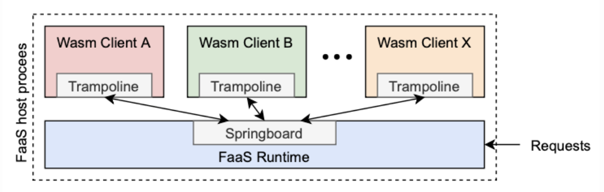
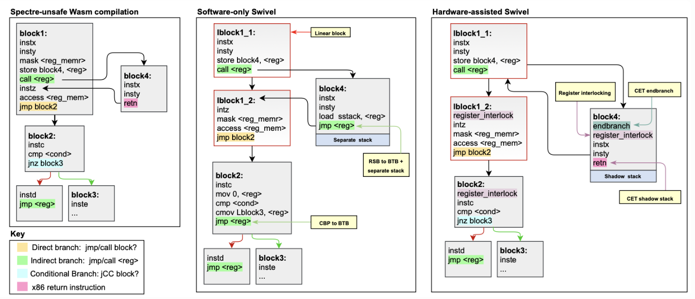
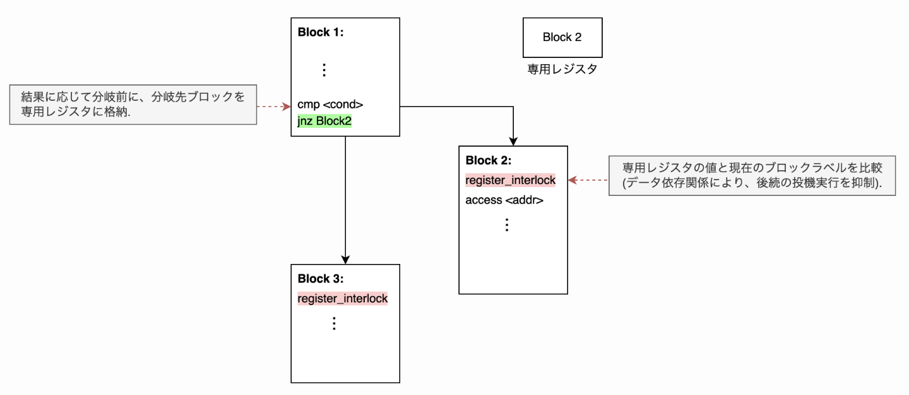
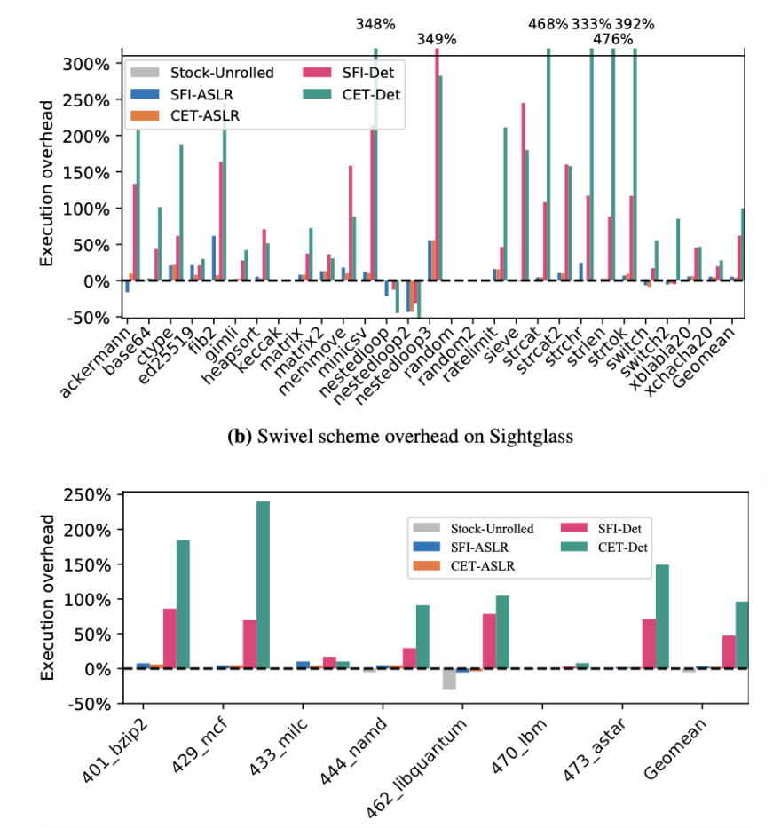
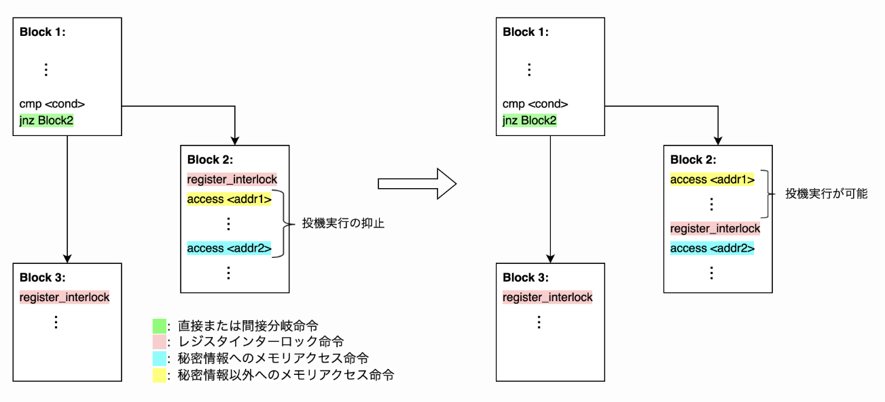
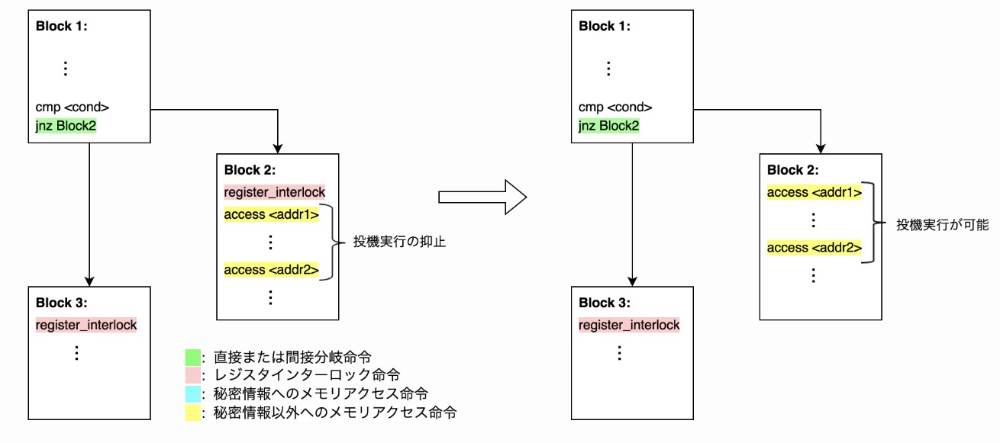
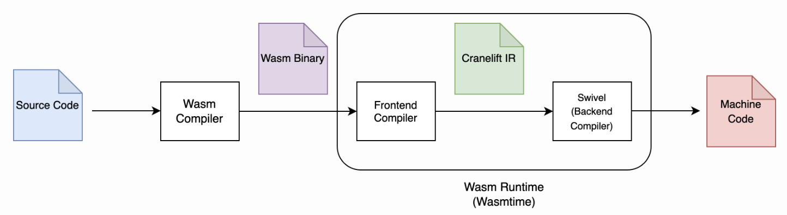

## 進捗報告(8/5)

### 今週やったこと

- Swivel[USENIX' 21]の調査
- 研究内容の深掘り

### 研究テーマについて

- PKUWA[CCS'23]を用いたSpectre防御手法を考えていたが、再検討
- 提案手法をSwivelと比較した時の優位性が見つけられない

### Swivelとの比較

- Swivelは広範囲なSpectre攻撃を防御することが可能.
  - Spectre-PHT, BTB, RSB
  - サンドボックス内外へのSpectre攻撃
- 自分の提案手法はサンドボックス内のSpectre攻撃にしか対応できない.

  - FaaSプラットフォームなど複数のサンドボックスが実行される状況で、サンドボックス外へのSpectre攻撃に対処する場合、数千~数万のドメイン分割が必要.
  - libmpkなどを使えば可能かもしれないが、オーバーヘッドなどを考えた場合、現実的では無い気がする.
    

- ガジェット探索に頼ると必ずFPやFNが発生する.
  - Swivelはコンパイラベースの防御手法
- PKUWAはソースコードが公開されていないし、バイナリも配布していない
  - Swivelはソースコードを公開している

Swivelを効率化する方向で研究テーマを再検討.

### Swivel-CET

- ハードウェア拡張を使用するSpectre防御手法
- Spectre-PHT,BTB対策として、Register interlocking手法を使用

#### Register interlocking

1. Wasmコードをリニアブロック(終端を除いて、制御フロー命令を含まない直線のコードブロック)にコンパイルする.
2. リニアブロックに一意の64ビットブロックラベルを割り当てる.
3. 直接分岐または間接分岐の分岐先として予想されるブロックラベルを計算し、分岐前にインターロックレジスタに割り当てる.
4. 各リニアブロックの先頭で、インターロックレジスタの値がブロックラベルと一致するかチェックする.
   - ブロックの先頭で必ずラベルの一致を検証するため、投機実行を抑制している
5. 一致しない場合、アドレス空間からページのマッピングを解除する(キャッシュ状態に影響を与えないようにする).

予想(考え中):

#### Swivel-CETのオーバーヘッド

- ベンチマークセットとして、SightglassとSPEC 2006 を使用.
- 拡張したLucetコンパイラでコンパイルし、デフォルト設定で10回繰り返し実行し、実行時間の中央値を報告.
- Swivel-CETのパフォーマンスオーバーヘッドを、標準のLucet コンパイラを使用した場合と比較.
- Sightglassでは 99.7%、SPECでは 8.0%～240.2% (幾何平均: 96.3%)のオーバーヘッドが発生.
- レジスタインターロックに対応するオーバーヘッドは、Sightglassで93.2%, SPECでは 53.4%を占める.
  

### 研究テーマ案

#### 問題提起

- Swivel-CETはSpectre攻撃に対して堅牢だが、オーバヘッドが非常に大きい.
- 特にレジスタインターロックは全てのメモリ操作の投機実行を抑制してしまうため、それが実行時オーバーヘッドの大半を占めている.

#### 提案手法

- Swivelは現在、メモリ内のすべての場所に秘密情報が含まれていると想定している.
- 秘密情報へのメモリアクセス命令の投機実行だけを抑制することで、Swivelのレジスタインターロックを効率化する.

1. ブロック内に秘密情報へのメモリアクセス命令がある場合 - 最も前にある秘密情報へのメモリアクセス命令の直前にレジスタインターロック命令を配置する. - レジスタインターロック命令より前に存在するメモリアクセス命令を投機的に実行できる.

  
2. ブロック内に秘密情報へのメモリアクセス命令が存在しない場合
   - レジスタインターロック命令を配置しない.
   - ブロック内の全てのメモリアクセス命令を投機的に実行できる.
  

#### 手順

1. ユーザがソースコード上で秘密情報にラベル付け
2. ラベルを追跡する
   - テイント解析などを利用？
3. 全てのメモリアクセス命令のアクセス範囲を特定
   - 区間抽象解釈などを利用？
   - 投機実行を考慮したアクセス範囲を求める必要がある(oo7を参考).
4. 各リニアブロックにレジスタインターロック命令を配置
   - ブロック内に秘密情報へのアクセスが無いなら、配置しない.
   - それ以外の場合は、最も前にある秘密情報へのメモリアクセスの直前に配置する.

#### 実装

- Wasmバイナリを解析するか、IRを解析するか?

  

#### その他

- 実験に必要なマシン
  - Swivelはintel CET, MPKを利用するため、クライアント向けCPU(Core)はTiger Lake(11世代)以降が必要.
  - 研究室のPCはintel Core i9(10世代).
- 候補
  - インテル® Core™i9-14900
  - インテル® Core™ i9-13900KS
  - インテル® Core™ i7-1165G7(mobile)
  - デスクトップPCかモバイルPCか

### 今後の予定

- **~ 8月上旬:** 研究内容を固める
  - レジスタインターロック手法の理解
    - Swivelを動かして理解したいが、研究室PCだと不可.
  - Motivating Example
    - ソース言語レベルで例
    - ループなど、秘密情報にアクセスしないもの
  - アノテーションの付け方の調査
    - アトリビュートなど既存の方法がwasmに落ちるのか調査
  - 技術的な課題は何か明確化
    - oo7など既存の方法をwasmに適用する時の課題
    - wasmやIRレベルで解析するとコールグラフなどの問題が生じる
    - ソースレベルで解析するのも考えてみる
      - wasmやIRレベルの解析だと精度に問題があるから、ソースレベルで解析を行う
    - IR解析の先行研究(Automatically Eliminating Speculative Leaks from Cryptographic Code with Blade('21))
  - PGOの活用について検討
    - ランタイムの実行時のプロファイリング情報を利用できないか？
    - ボトルネック部分をプロファイルで特定し、その部分だけセンシティビティの高い解析を行うことで、高精度かつ高速に防御力を高める
    - ランタイムがどういうプロファイル情報をとってるのか調べる
- **8月中旬 ~ 9月上旬**: 実装, 中間発表の準備
